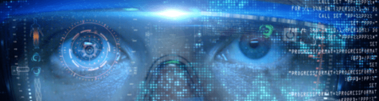

**I aim to create content of the highest quality - relating complex subjects in a clear and concise fashion - supplying essential details, with quality sources for further study.**

I'm primarily interested in Bitcoin, *decentralized identity*, blockchain, cryptocurrencies, programming in general, and [data science](https://www.csbtechemporium.com/deep-learning-revolution/).

Though I'm not a developer, my research and content creation has leaned towards more technical subjects, requiring that I become familiar with the general history of software development, it's various branches, and how they inter-relate. 

I *am* planning to learn Python, along with a million other things. Right now, I'm focused on the fundamentals of web development. 

Soon I'll be more focused on perfecting the content itself, now that I'm done shopping for themes and just need to set the one up I've chosen, and co-ordinate across the pages.

**My Ultimate Goal: Create a reasonably comprehensive index for the ecosystem of information surrounding Bitcoin, Blockchain, and Cryptocurrency.**

That's the lens through which I operate.

This site is my research, and writing, portfolio. Any articles, or resources, linked directly from this page were authored by, yours truly. There are also a few transcripts that I cleaned up from youtube's auto-transcribe.

Branching off from infominer.id are research projects in varying states of development. I've worked out basically how I want to set it up, and am making progress. It will take a couple weeks for things to get very orderly around here.

## Index
* [DID-Identity Decentralized](#did-identity-decentralized-)
* [Bitcoin History](#bitcoin-history-)
  * [Pre-History and Fundamentals](#bitcoin-pre-history-and-crypto-fundamentals)
* [Learn Crypto Trading](#learn-crypto-trading-)
* [Web Development](#web-development-)
* [Source⧉Crypto](#sourcecrypto--research-index-discord-chat-)
* [Services](#services-)
  * [Research Consulting](#research-consulting-)
  * [Information Dense Content](#information-dense-content-)
* [Contact](#contact-)
* [Tips Jar](#tips-jar-)

I seek out source-grade material, to catalog and record. 

Publishing allows me to organize information in a way that vastly expands my ability to learn and gather more information. Making these complex topics easier to navigate, and accessible for those who aren't able to spend most of their time studying crypto.

## DID-Identity Decentralized [**^**](#index)

Over the past year, a number of different clients hired me to write about decentralized identity, and I was getting pretty deep into it, when I decided to share the resources I had collected on GitHub. From there, it's turned into a passion. This is my most highly developed research project, to-date.

The rise of Bitcoin has brought new life to the quest for a decentralized - vendor agnostic - identity layer for the internet, that began around the early 2000's. Today, we are closer than ever to a sensible approach to identity online.

As far as I can tell, this is blockchain's breakthrough application, beyond currency. Efforts to create a decentralized identity layer for the internet have persevered since the early 2000's, experiencing surge of energy with the rise of Bitcoin.

* <a href="https://infominer.id/DIDecentralized">infominer.id/DIDecentralized</a> —Epic repository of DID and SSI Resources.
  * <a href="DIDecentralized/identity-github/">SSI Related Github Repositories</a> 
  * <a href="DIDecentralized/workshops/rebooting-web-of-trust/">Rebooting Web of Trust - Papers and Advance Readings Index</a>
  * [Microledgers and Edge-Chains—Daniel Hardman, Evernym](Microledgers-Edgechains-Hardman.html) - Transcript
  * [Verifiable Organizations Network: A Production Government Deployment of Hyperledger Indy](transcripts/VerifiableOrganizationsNetwork-HGF.html) - Transcript

## Bitcoin History [**^**](#index)

I'm fascinated by all the history surrounding Bitcoin, and tech generally, but especially any aspects that directly relate to Bitcoin in some fashion. It's easier to understand blockchain and cryptocurrency, if you start near the beginning with one-way hash functions, and public key encryption, and you can trace the efforts of people through the years to create, and the efforts of states to suppress encryption. 

Most of blockchain mania could be solved with plain old encryption, but encryption was suppressed for so long, it took Bitcoin to get governments to go along with crypto-innovations, publically anyhow. Industry was on board a long time ago to be creative with cryptography, but governments suppressed it. So now that we're all losing our minds... What even is Crypto?>>>>

* [infominer.id/bitcoin-history](https://infominer.id/bitcoin-history)
  * [Electronic Cash and Virtual Currencies, Before Bitcoin](history-electronic-cash.html)
  * [Cypherpunks and the Crypto Wars](cypherpunks.html)
  * [Blockchain and the United Nations](blockchain-united-nations.html)
  * [History of Permissioned Ledgers](permissioned-ledger-history.html)
* <a href="https://github.com/infominer33/bahamas-crypto" target="_blank">/bahamas-crypto</a> —Blockchain in the Bahamas. 

**Articles**
* <a href="https://www.axiomtech.io/blog-feed/2018/9/24/pre-digital-cryptography-a-history" target="_blank">Pre-Digital Cryptography</a>
* <a href="https://www.axiomtech.io/blog-feed/electronic-currency-before-bitcoin" target="_blank">The Quest for Electronic Currency—Before Bitcoin</a>
* <a href="https://www.axiomtech.io/blog-feed/hyperledger-indy-decentralized-identity" target="_blank">The Future of Decentralized Identity—Hyperledger Indy</a>
* <a href="https://www.axiomtech.io/blog-feed/2019/3/1/blockchain-in-the-united-nations" target="_blank">A Reasonably Complete Outline of Blockchain in the United Nations</a>
* <a href="https://www.axiomtech.io/blog-feed/history-of-permissioned-ledgers" target="_blank">The Times and History of Permissioned Ledgers</a>
* <a href="https://www.axiomtech.io/blog-feed/2018/10/9/smart-contracts-uses-cases-dapps-icos" target="_blank">Introduction to Smart Contracts</a>

**Shorts**

* [David Chaum - The Father of Digital Cash](https://archive.is/lxKiU)
* [The Birth of the Cypherpunks](https://archive.is/Hi9JQ)
* [The Rise of the Cypherpunks](https://archive.is/z0wEZ)

### -Transcripts
These don't' necessarily fit in one place. Once I switch the theme over and get cozy, all of this stuff will have it's own pages.
* [JW Weatherman Interviews Cypherpunk Legend Timothy C May](transcripts/JW-Weatherman-Interview-Tim-May/) - Transcript
* [Stephan Levira Podcast 53 - Andreas M. Antonopoulos - On Bitcoin Maximalism](/transcripts/SLP53-Antonopolis-on-Maximalism-Transcript) - transcript
* [History of Blockchains for Business — Casey Kuhlman, Monax](blockchain-for-business-history/) - transcript

## Learn Crypto Trading [**^**](#index)

Trading \ technical analysis is the subject I've studied the least, of almost anything, but this is my fastest growing repository (in followers) besides DIDecentralized (surprise surprise). 

My digital transformation tour-guide told me that means I should give it a heading here. Jokes aside, I do plan to study more and hope to find some clients who would like content created on the subject, that really helps me to dive deeper into a topic than I have the attention span for my own purposes. 

* <a href="https://infominer.id/learn-crypto-trading">infominer.id/learn-crypto-trading</a> 
  * [Candlesticks](https://infominer.id/learn-crypto-trading/candlesticks/) - All About Candlestick Patterns
  * [Chart Patterns](https://infominer.id/learn-crypto-trading/chart-patterns/) - Notes taken accompanied by the Encyclopedia of Chart patterns by Thomas Bulkowski.
  * [Quantitative](https://infominer.id/learn-crypto-trading/quant/) - Quantitative-Crypto Trading and Data Science
  * [Pinescript-TradingView](https://infominer.id/learn-crypto-trading/pinescript/)

## Web Development [**^**](#index)

* [Github Pages Starter Pack](https://infominer.id/gh-pages-starter-pack.html)
* <a href="https://www.csbtechemporium.com/web-design-history/" target="_blank">Brief History of Web Design</a>
* <a href="https://www.csbtechemporium.com/keyword-research-fundamentals/" target="_blank">Keyword Research Fundamentals</a>
* <a href="https://csbtechemporium.com/seo-simplified-2019" target="_blank">SEO Simplified! Increase your Rankings 2019!</a>
* <a href="https://github.com/infominer33/Learn-SEO" target="_blank">/Learn-SEO</a> —Learn-SEO 
  * [100's of Mostly Free SEO Tools](https://infominer.id/seo-tools.html)

## Source⧉Crypto — Research Index Discord Chat [**^**](#index)

I follow cryptographers, developers, academics, cypherpunks, maximalists, generalists, enterprise, traders, etc. — re-tweeting valuable information to collect, organize, and catalog in the 100+ channels of [Source⧉Crypto Discord Chat](https://discord.gg/ahTuPMY). 

I've gradually been moving those links from discord to Github in TOML format, to become a database that powers a dynamic web portal. From there, it's not so hard to spin up [github-pages](/notes.html) for it all. 

>All of this is <a href="https://creativecommons.org/publicdomain/zero/1.0/">CC0 - Public Domain</a>, so others can easily join in, or build from in their own way. 🤓

* [infominer.id/SourceCrypto](https://infominer.id/SourceCrypto) - this site will expand to become the biggest of all, hosting most crypto research that doesn' fit specifically into history trading or decentralized-id.

IDK really, how this repository will grow.. it might make more sense to consolidate into a few repositories, than to constanly open a new repo for each subject.
 
I suppose I will have new favorite pet projects, as time goes on, that I want to have their own pages.

**Articles**
* <a href="https://www.axiomtech.io/blog-feed/introduction-proof-of-stake" target="_blank">Introduction to Proof of Stake</a>
* <a href="https://www.csbtechemporium.com/become-a-blockchain-developer/" target="_blank">Blockchain Developing Resources</a>
* [Business with Crypto 101—Escrow and Key Signatures](https://freelanceforcoins.com/article/6-escrow)

**Shorts**
* [Proof of Work in a Nutshell](https://archive.is/dkV0Z)
* [Cryptographic Hash Functions](https://archive.is/UgiJ9)
* [What's a Cryptographic Primitive?](https://archive.is/Fmjv5)
* [Zero Knowledge Proofs](https://archive.is/6k10u)

## Services

I offer ***content creation* and *research consulting*** services.

### Research Consulting [**^**](#index)

In-depth research is time-consuming. In crypto, the matter is made even more challenging because of the vast amount of domain knowledge required to obtain quality results. What I lack in experience, I make up for with relentless search habits.

I ask questions to ensure I understand what my clients need, commonly checking in to show my progress and ensure I'm providing value.

I have a passion for learning, enjoy crypto-related research, and would love to help with your research needs.

### Information Dense Content [**^**](#index)

I'm experienced at writing on subjects that I previously knew little about. My primary focus is education, simplicity, and accuracy. I'm not a fast writer. 

I enjoy writing high-level overviews of blockchain platforms that can serve as an introduction to developers.  

---

**ISO clients who want Bitcoin-related content for their websites.**

---

One project I'm hoping to find a buyer for is a series of articles on the history surrounding Bitcoin. 

**Rough Outline**
* History of Cryptography:
  * Public Key Encryption (currently only available in books)
  * Hash Algorithms
* Distributed Systems \ Consensus
* History of Cypherpunks
  * History of p2p networking
* History of open source
* History of The Federal Reserve
* History of Digital Currency Before Bitcoin 
* Birth of Bitcoin
* 2012-2016
* 2017

## Contact
 
*  <a href="mailto:infominer@protonmail.com" target="_blank">infominer@protonmail.com</a> 
* [keybase.io/infominer](https://keybase.io/infominer)
*  <a href="https://twitter.com/cryptinfominer" target="_blank">twitter.com/infominer33</a> 
*  <a href="https://t.me/InfoMiner33" target="_blank">t.me/InfoMiner33</a> 
*  <a href="https://discord.gg/ahTuPMY" target="_blank">Source⧉Crypto</a> Discord Chat. 
*  live:5c39bf65a11f27a9 (Skype) 
*  <a href="https://tippin.me/@infominer33" target="_blank">tippin.me/@infominer33</a> 

## Tips Jar [**^**](#index)

[https://tippin.me/@infominer33](https://tippin.me/@infominer33)

BTC— 1A1DZfw4VgpHCgnMjnmfDnMjddKf8xdYbd

 

DOGE— DEFqLsXX2o5QqsYsRn5g9d2Aba5L5xAVLM

 

